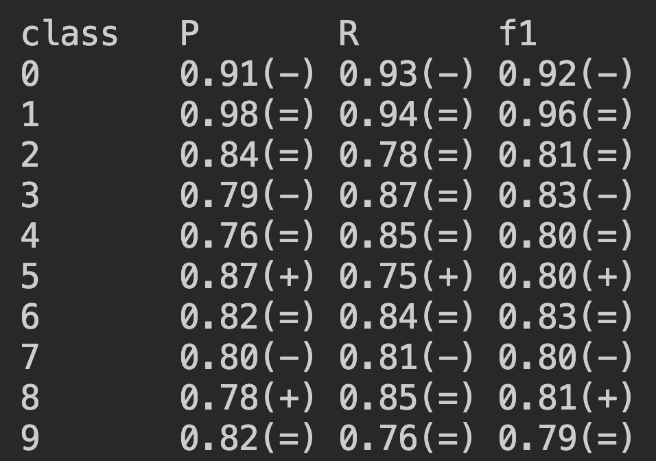

###  Neural Network Framework in c
very simple neural network framework in c with which users can implement feedforward NNs to solve classification and regression problems.

in main.c the framework is tested on mnist dataset. the model consists of 2 layers, first layer has leaky relu as activation function and second layer has softmax as activation function. the model uses cross entropy loss as loss function.

**size of training set&ensp;  = 3500** 
**size of test set &emsp;&emsp; = 1500**

following is the precision statistics after 30th epochs:

the sybols "(+)", "(-)" and "(=)" besides each stat value is a comparision to value of previous epoch, for e.g. 0.91(-) means that the precision of class "0" of the current epoch is smaller than the precision of same class of previous epoch.

