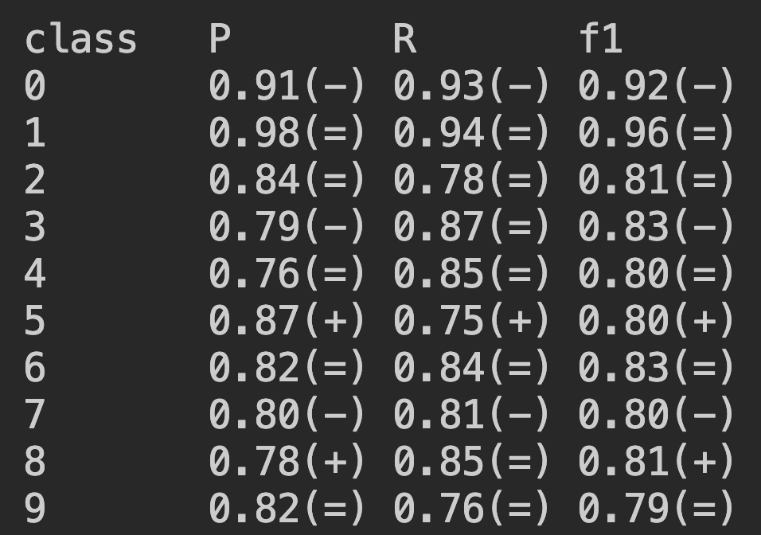

###  Neural Network Framework in c
very simple neural network framework in c with which users can implement feedforward NNs to solve classification and regression problems.

### Tensor Implementation
The matrix library implemented from scratch has been refactored to represent an implementation of tensors rather than simple matrices. The reason beeing that this could simplify the implementation of convolution layers where a lot of tensors are sliced and reshaped (note: that there is no implementation of reshape function yet!).

---
 
The main difference between matrix and tensor is like the difference between a matrix and a vector. And so a matrix has 2 dimensions and a tensor can be multidimensional.

---

### Last Commit Notes:
This commit --unlike the version before-- comments out the implementation of leaky_relu and tanh activation funcitons in order to refactor and implement the tensor system faster.

This version is a preparation step to implement cross_correlation_2D which is a very important matrix product for convolutions layers.

Currently the work is focused on designing the implementation of conv layers with pooling and padding functionalities.

---

### Example Model Implementation

in [main.c](main.c) the framework is tested on mnist dataset. the model consists of 2 layers, first layer has leaky relu as activation function and second layer has softmax as activation function. the model uses cross entropy loss as loss function.

**size of training set&ensp;  = 3500** 
**size of test set &emsp;&emsp; = 1500**

following is the precision statistics after 30th epochs:

the sybols "(+)", "(-)" and "(=)" besides each stat value is a comparision to value of previous epoch, for e.g. 0.91(-) means that the precision of class "0" of the current epoch is smaller than the precision of same class of previous epoch.

---

### Support:
**supported layers types**: 
* Linear Layer | represented by struct Dense

**supported activation functions**: 
* relu
* ~~leaky relu~~
* ~~tanh~~
* sigmoid
* softmax

**supported loss functions**: 
* mse
* cross entroppy loss

---
### Worth to implement:
**supported layers types**: 
* Convolution Layer
* Pooling Layers
* Batch Normalization

**supported loss functions**: 
* BCE
* IOU

